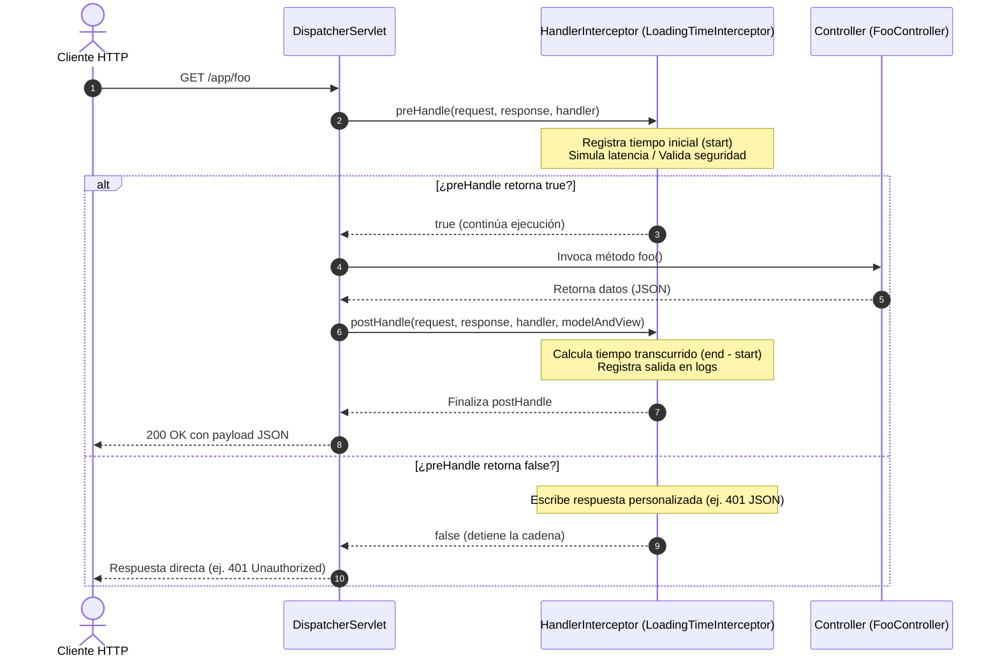

# 🚀 Spring Boot - Manejo de Interceptores HTTP

<div align="center">


<p align="center">
  <b>Demostración práctica del ciclo de vida, configuración y casos de uso de <code>HandlerInterceptor</code> en Spring Boot.</b>
</p>

</div>

---

## 📖 Tabla de Contenidos

- [🎯 Descripción del Proyecto](#-descripción-del-proyecto)
- [🔄 ¿Cómo funcionan los Interceptores en Spring?](#-cómo-funcionan-los-interceptores-en-spring)
  - [Ciclo de Vida de una Petición](#ciclo-de-vida-de-una-petición)
  - [HandlerInterceptor vs Filter](#handlerinterceptor-vs-filter)
- [✨ Características Implementadas](#-características-implementadas)
- [📁 Estructura del Proyecto](#-estructura-del-proyecto)
- [⚙️ Configuración y Código Clave](#️-configuración-y-código-clave)
  - [1. Interceptor de Tiempo de Carga](#1-interceptor-de-tiempo-de-carga)
  - [2. Registro y Enrutamiento en Spring MVC](#2-registro-y-enrutamiento-en-spring-mvc)
  - [3. Controladores de Prueba](#3-controladores-de-prueba)
- [🚀 Instalación y Ejecución](#-instalación-y-ejecución)
- [🧪 Pruebas y Consumo de Endpoints](#-pruebas-y-consumo-de-endpoints)
  - [Ejemplo de Petición HTTP](#ejemplo-de-petición-http)
  - [Salida en Consola (Logs)](#salida-en-consola-logs)
- [🛠️ Tecnologías Utilizadas](#️-tecnologías-utilizadas)
- [👤 Autor](#-autor)

---

## 🎯 Descripción del Proyecto

Este proyecto es una guía práctica y funcional que ilustra cómo interceptar peticiones HTTP en aplicaciones **Spring Boot** utilizando la interfaz `HandlerInterceptor`.

A través de un ejemplo conciso y desacoplado, se implementa:
1. **Métricas de rendimiento:** Cálculo exacto del tiempo de respuesta y demora de ejecución de los controladores.
2. **Filtro selectivo de rutas:** Inclusión y exclusión de patrones de URL (`addPathPatterns` / `excludePathPatterns`).
3. **Inspección de peticiones:** Acceso reflexivo al método del controlador que procesa la solicitud mediante `HandlerMethod`.
4. **Interrupción y seguridad (Proof of Concept):** Ejemplo de cómo bloquear solicitudes no autorizadas devolviendo respuestas en formato JSON con códigos de error HTTP (por ejemplo `401 Unauthorized`).

---

## 🔄 ¿Cómo funcionan los Interceptores en Spring?

Los interceptores forman parte del subsistema de **Spring MVC**. Se sitúan entre el `DispatcherServlet` y los controladores (`@Controller` / `@RestController`), permitiendo ejecutar lógica transversal previa o posterior al procesamiento de la lógica de negocio.

### Ciclo de Vida de una Petición



### HandlerInterceptor vs Filter

| Característica | `HandlerInterceptor` (Spring MVC) | `Filter` (Servlet API standard) |
|---|---|---|
| **Capa de Ejecución** | Dentro del contexto de Spring MVC (después de `DispatcherServlet`). | Contenedor de Servlets (antes de llegar a Spring MVC). |
| **Acceso a Beans** | Integración total con `@Autowired`, `@Component`, contexto de Spring. | Más limitado, requiere configuración especial. |
| **Conocimiento del Handler** | Conoce el método del controlador a invocar (`HandlerMethod`). | Desconoce qué controlador o método atenderá la petición. |
| **Manipulación de Vista** | Acceso a `ModelAndView` antes de renderizar la vista. | No tiene conocimiento de `ModelAndView`. |
| **Casos de Uso Típicos** | Métricas de controladores, auditoría, verificación de permisos específicos de ruta, inyección de atributos de modelo. | Compresión GZIP, autenticación y CORS global, multipart parsing, filtros de seguridad perimetral. |

---

## ✨ Características Implementadas

- [x] **Cálculo de Latencia:** Almacenamiento del timestamp inicial en `HttpServletRequest` y cálculo del diferencial en el `postHandle`.
- [x] **Simulación de Demora:** `Random delay` (`Thread.sleep`) para emular tiempos variables de procesamiento en servicios reales.
- [x] **Inspección de Métodos:** Lectura dinámica del nombre del método ejecutado mediante casting a `HandlerMethod`.
- [x] **Enrutamiento Inteligente:** Aplicación exclusiva para rutas bajo el prefijo `/app/**`.
- [x] **Demostración de Bloqueo:** Código preparado para abortar la petición tempranamente y responder con JSON cuando una validación falle.

---

## 📁 Estructura del Proyecto

```plaintext
springboot-interceptor
├── pom.xml
├── README.md
└── src
    ├── main
    │   ├── java
    │   │   └── com/gustavo/curso/springboot/app/interceptor/springboot_interceptor
    │   │       ├── SpringbootInterceptorApplication.java   # Clase principal
    │   │       ├── MvcConfig.java                         # Registro y mapeo del interceptor
    │   │       ├── controllers
    │   │       │   └── FooController.java                 # Endpoints REST de prueba (/app/**)
    │   │       └── interceptors
    │   │           └── LoadingTimeInterceptor.java        # Implementación de HandlerInterceptor
    │   └── resources
    │       └── application.properties                     # Configuración de la aplicación
    └── test
        └── java
            └── com/gustavo/curso/springboot/app/interceptor/springboot_interceptor
                └── SpringbootInterceptorApplicationTests.java
```

---

## ⚙️ Configuración y Código Clave

### 1. Interceptor de Tiempo de Carga

Implementa `HandlerInterceptor` y se registra como componente gestionado por Spring (`@Component("timeInterceptor")`):

```java
@Component("timeInterceptor")
public class LoadingTimeInterceptor implements HandlerInterceptor {

    private static final Logger logger = LoggerFactory.getLogger(LoadingTimeInterceptor.class);

    @Override
    public boolean preHandle(HttpServletRequest request, HttpServletResponse response, Object handler) throws Exception {
        HandlerMethod controller = ((HandlerMethod) handler);
        logger.info("LoadingTimeInterceptor: preHandle() entrando... " + controller.getMethod().getName());

        long start = System.currentTimeMillis();
        request.setAttribute("start", start);

        Random random = new Random();
        int delay = random.nextInt(500);
        Thread.sleep(delay);

        return true; // true para continuar la cadena hacia el controlador
    }

    @Override
    public void postHandle(HttpServletRequest request, HttpServletResponse response, Object handler,
            @Nullable ModelAndView modelAndView) throws Exception {
        long end = System.currentTimeMillis();
        long start = (long) request.getAttribute("start");
        long result = end - start;

        logger.info("Tiempo transcurrido: " + result + " milisegundos!!");
        logger.info("LoadingTimeInterceptor: postHandle() saliendo... " + ((HandlerMethod) handler).getMethod().getName());
    }
}
```

### 2. Registro y Enrutamiento en Spring MVC

Implementa `WebMvcConfigurer` para registrar el interceptor en el contenedor y definir las reglas de filtrado:

```java
@Configuration
public class MvcConfig implements WebMvcConfigurer {

    @Autowired
    @Qualifier("timeInterceptor")
    private HandlerInterceptor timeInterceptor;

    @Override
    public void addInterceptors(InterceptorRegistry registry) {
        // Aplica únicamente a las rutas bajo /app/**
        registry.addInterceptor(timeInterceptor).addPathPatterns("/app/**");

        // Opcional: Para excluir rutas concretas
        // registry.addInterceptor(timeInterceptor).excludePathPatterns("/app/publico/**");
    }
}
```

### 3. Controladores de Prueba

El controlador `FooController` expone tres endpoints bajo el prefijo `/app`:

```java
@RestController
@RequestMapping("/app")
public class FooController {

    @GetMapping("/foo")
    public Map<String, String> foo() {
        return Collections.singletonMap("message", "Handler foo del controlador");
    }

    @GetMapping("/bar")
    public Map<String, String> bar() {
        return Collections.singletonMap("message", "Handler bar del controlador");
    }

    @GetMapping("/baz")
    public Map<String, String> baz() {
        return Collections.singletonMap("message", "Handler baz del controlador");
    }
}
```

---

## 🚀 Instalación y Ejecución

### Prerrequisitos

- **Java JDK 17** o superior instalado y configurado en el `PATH`.
- **Git** instalado.

### Pasos

1. **Clonar el repositorio:**
   ```bash
   git clone https://github.com/GusDev071/Interceptores-de-springboot.git
   cd Interceptores-de-springboot
   ```

2. **Compilar y descargar dependencias:**
   - En Windows (PowerShell / CMD):
     ```powershell
     .\mvnw.cmd clean compile
     ```
   - En Linux / macOS:
     ```bash
     ./mvnw clean compile
     ```

3. **Iniciar la aplicación:**
   - En Windows (PowerShell / CMD):
     ```powershell
     .\mvnw.cmd spring-boot:run
     ```
   - En Linux / macOS:
     ```bash
     ./mvnw spring-boot:run
     ```

La aplicación arrancará por defecto en el puerto `8080` (`http://localhost:8080`).

---

## 🧪 Pruebas y Consumo de Endpoints

### Ejemplo de Petición HTTP

Puedes probar los endpoints usando `curl`, Postman o cualquier navegador web:

#### Petición 1: `/app/foo`
```bash
curl -X GET http://localhost:8080/app/foo
```
**Respuesta:**
```json
{
  "message": "Handler foo del controlador"
}
```

#### Petición 2: `/app/bar`
```bash
curl -X GET http://localhost:8080/app/bar
```
**Respuesta:**
```json
{
  "message": "Handler bar del controlador"
}
```

#### Petición 3: `/app/baz`
```bash
curl -X GET http://localhost:8080/app/baz
```
**Respuesta:**
```json
{
  "message": "Handler baz del controlador"
}
```

---

### Salida en Consola (Logs)

Al realizar cualquiera de las peticiones anteriores, podrás observar en la terminal cómo el interceptor captura la entrada y la salida con el cálculo de tiempo:

```log
INFO  [springboot-interceptor] [...] c.g.c.s.a.i.s.i.LoadingTimeInterceptor : LoadingTimeInterceptor: preHandle() entrando... foo
INFO  [springboot-interceptor] [...] c.g.c.s.a.i.s.i.LoadingTimeInterceptor : Tiempo transcurrido: 342 milisegundos!!
INFO  [springboot-interceptor] [...] c.g.c.s.a.i.s.i.LoadingTimeInterceptor : LoadingTimeInterceptor: postHandle() saliendo... foo
```

---

## 🛠️ Tecnologías Utilizadas

- **Lenguaje:** [Java 17](https://www.oracle.com/java/technologies/javase/jdk17-archive-downloads.html)
- **Framework:** [Spring Boot](https://spring.io/projects/spring-boot)
  - `spring-boot-starter-webmvc`: Desarrollo de APIs REST y configuración del ciclo de vida web.
  - `spring-boot-starter-actuator`: Monitoreo y métricas del sistema.
  - `spring-boot-devtools`: Recarga en caliente durante el desarrollo.
- **Gestor de Construcción:** [Apache Maven](https://maven.apache.org/)
- **Logging:** SLF4J & Logback

---

## 👤 Autor

Desarrollado por **Gustavo** ([@GusDev071](https://github.com/GusDev071)) como parte de los proyectos de formación en el ecosistema Spring Boot.

---

<div align="center">
  ⭐ Si este proyecto te resultó útil, no olvides darle una estrella en GitHub.
</div>
